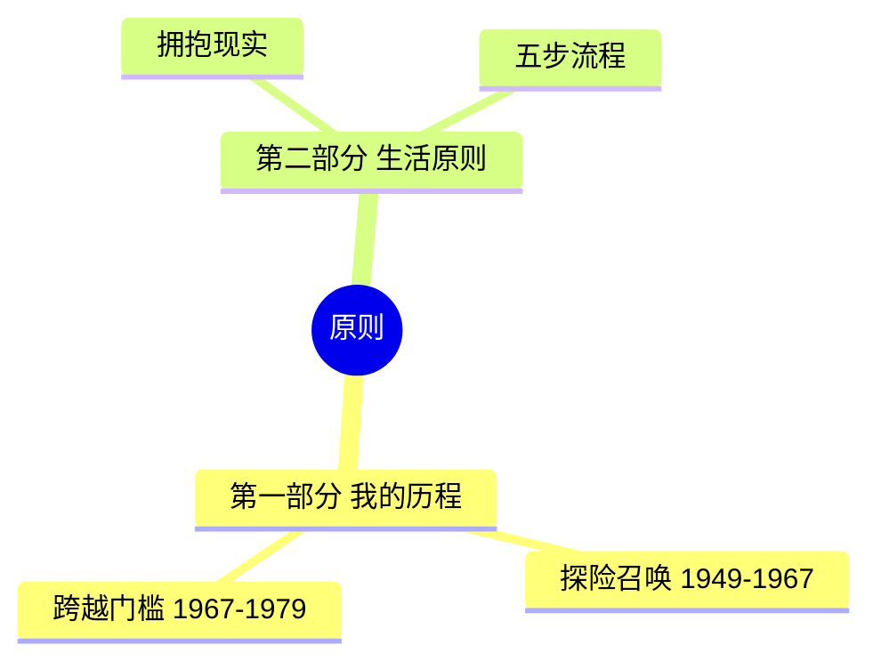
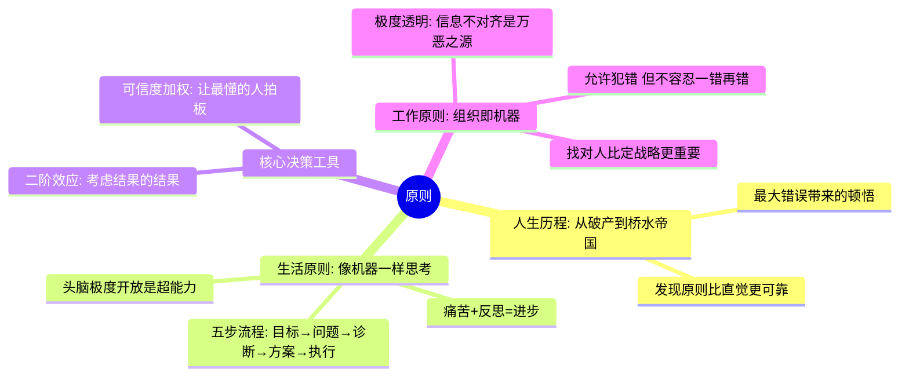
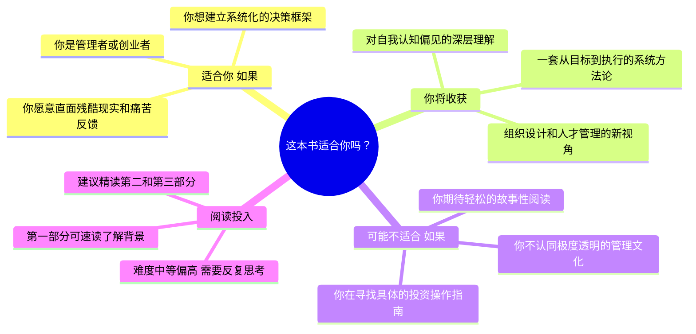

# 检视阅读

结合微信读书数据源和飞书文档能力，为任意书籍生成一份结构化的检视阅读报告。

检视阅读（Inspectional Reading）源自 Mortimer Adler 的阅读方法论——在深度阅读之前，通过系统性的略读快速建立对一本书的心智模型：它讲了什么、结构如何、核心观点是什么、值不值得花时间精读。这个 skill 把这个过程自动化，并用可视化图表让它更直观。

## 依赖

- **weread skill**（`~/.claude/skills/weread`）：微信读书数据源
- **lark-doc skill**（`~/.claude/skills/lark-doc`）：飞书文档创建与编辑
- **lark-whiteboard skill**（`~/.claude/skills/lark-whiteboard`）：飞书画板图表绘制（全景图、匹配图）
- **beautiful-feishu-whiteboard skill**（`~/.claude/skills/beautiful-feishu-whiteboard`）：核心洞察图的 SVG 渲染，提供 35 种配色风格目录 + 经实证验证的画板硬规则（`RULES.md`）

## 前置检查

开始前确认环境就绪，任何一项失败都应提示用户：

```bash
echo $WEREAD_API_KEY  # 必须非空
lark-cli --version     # 必须可用
npx -y @larksuite/whiteboard-cli@^0.2.11 -v  # 必须可用
```

## 工作流

整个过程分为三个阶段：**数据采集 → 类型分析与内容策划 → 文档创建与图表绘制**。

### Phase 1: 数据采集

这一阶段从微信读书获取全面的书籍信息。数据越丰富，最终报告质量越高。

> 调用任何 weread 接口前，必须先阅读 weread skill 对应的说明文件确认参数和字段含义。每次请求必须带 `skill_version`。所有参数平铺在 JSON body 顶层，不要包在 `params` 里。

**Step 1.1: 搜索并确认书籍**

1. 读 weread skill 的 `search.md`
2. 调 `/store/search`（`scope=10` 电子书），获取 `bookId`
3. 展示搜索结果（书名、作者、评分），让用户确认目标书籍
4. 记住 `bookId`，后续步骤全部复用

**Step 1.2: 获取书籍详情与目录**

并行调用以下接口（读 weread skill 的 `book.md` 确认参数）：

| 接口 | 用途 |
|------|------|
| `/book/info` | 书名、作者、评分、简介、分类（`category`）、出版信息、字数 |
| `/book/chapterinfo` | 完整章节目录，含层级（`level`），是生成结构思维导图的核心数据 |
| `/book/getprogress` | 用户阅读进度和时长（判断是否读过） |

**Step 1.3: 获取划线数据**

并行调用以下接口（读 weread skill 的 `notes.md`）：

| 接口 | 用途 |
|------|------|
| `/book/bestbookmarks` | 全书热门划线（含原文和划线人数），反映读者群体共识 |
| `/book/bookmarklist` | 用户的个人划线（如果用户读过这本书） |
| `/review/list/mine` | 用户的个人想法/点评（注意参数名是 `bookid`，小写） |

### Phase 2: 类型分析与内容策划

**Step 2.1: 判定书籍类型**

综合以下信息判定书籍类型：
- `/book/info` 返回的 `category` 字段
- 书籍简介关键词
- 章节标题风格（例如"第 X 章"偏向叙事，"1.1 X 概念"偏向技术）

类型映射表（详细的判定规则和模板见 `references/book-type-templates.md`）：

| 类型关键词 | 检视阅读类型 | 核心洞察图重点 |
|-----------|-------------|---------|
| 文学/小说/名著/推理/科幻 | 小说文学 | 人物关系 + 情节推进 + 命运循环 |
| 计算机/编程/技术/工程 | 技术实践 | 知识体系 + 学习路径 + 能力飞轮 |
| 哲学/思想/宗教/伦理 | 哲学思想 | 论证链路 + 思辨推演 + 认知升级 |
| 商业/管理/经济/投资 | 商业管理 | 框架模型 + 执行流程 + 组织飞轮 |
| 历史/传记/回忆录/纪实 | 历史传记 | 因果时间线 + 事件因果链 + 历史螺旋 |
| 科学/科普/自然/数学 | 科学科普 | 概念演进 + 发现过程 + 认知螺旋 |
| 心理/自助/成长/健康 | 心理自助 | 方法论地图 + 改变路径 + 改变循环 |
| 社科/政治/教育/法律 | 社会科学 | 论点结构 + 论证流程 + 社会演变 |

**Step 2.2: 规划文档结构**

通用文档结构（所有类型共享，但各部分详略因类型而异），对应 Adler 检视阅读的四个核心问题——整体在谈什么、细部怎么说的、说得有道理吗、跟你有什么关系：

1. **📖 书籍基本信息** — 书名、作者、出版年份、版本、篇幅、适用对象
2. **💡 这本书在谈什么** — 一句话概括（总）+ 类型、核心立场、与同类书差异的表格（分）
3. **🗺️ 整体架构与关键概念** — 全书主线一句话（总）+ 各部分议题与洞察的结构表格（分）+ 书籍全景图
4. **❓ 核心问题与论证逻辑** — 核心问题与作者答案的 Q&A 表格（总）+ 论证路径列表（分）+ 核心洞察图
5. **🧐 评价：价值、局限与适用性** — 一句话总评（总）+ 亮点、局限、偏见、时效性分类展开（分）
6. **⚖️ 检视阅读结论** — 是否值得分析阅读、建议阅读方式、对读者的意义（含读者匹配图）

**Step 2.3: 内容深度分析**

用 **5W1H 框架**对书籍内容做深度分析，确保各章节内容有充分思考深度。这些分析不直接输出到文档，而是作为内容素材贯穿到 🗺️ 整体架构与关键概念、❓ 核心问题与论证逻辑、🧐 评价：价值、局限与适用性等章节。**分析结论必须传递到 Step 3.3 的文档内容和 Step 3.4 的 subagent 数据包中**——没有写进文档或数据包的分析等于白做：

| 维度 | 引导方向 | 分析要点 |
|------|---------|---------|
| **Who** | 主体与利益相关者 | 谁是这本书的核心受益者？谁的观点被忽略了？ |
| **What** | 核心内容与概念 | 这本书的核心论点是什么？关键概念之间的本质区别？ |
| **When** | 时效性与条件 | 作者的结论在今天仍然成立吗？在什么条件下会失效？ |
| **Where** | 场景与边界 | 适用场景和边界在哪里？跨文化背景下的差异？ |
| **Why** | 根本原因与逻辑 | 最核心的假设是什么？论证链是否完整？ |
| **How** | 实践与行动 | 核心方法论如何在现实中落地？ |

### Phase 3: 文档创建与图表绘制

**Step 3.1: 读取飞书文档技能参考**

读取以下文件（只读存在的文件）：

1. `~/.claude/skills/lark-shared/SKILL.md` — 认证和全局参数（必读）
2. `~/.claude/skills/lark-doc/SKILL.md` — lark-doc 主文件（必读）
3. `~/.claude/skills/lark-doc/references/lark-doc-create.md` — 创建命令详解（必读）

> 注意：lark-doc 的 SKILL.md 可能引用了 `lark-doc-xml.md` 和 `style/` 目录下的文件。如果这些文件不存在，跳过即可——关键命令和参数已经在上面列出的文件中覆盖。不要因为找不到参考文件而卡住。追加内容时再按需读 `lark-doc-update.md`。

**Step 3.2: 准备文档**

先判断用户是否提供了飞书文档地址：

- **用户提供了文档 URL**：用 `docs +fetch --api-version v2 --doc <URL>` 读取文档获取 doc_id，后续用 `docs +update --command append` 追加内容。先追加 `<h1>《书名》检视阅读报告</h1>` 作为标题分隔。
- **用户未提供文档**：用 `lark-cli docs +create --api-version v2 --content '<title>《书名》检视阅读报告</title>'` 创建新文档。

`--content` 只传 `<title>`。所有章节内容（h1 标题 + 正文 + 画板占位符）在下一步按顺序 append，确保内容紧跟对应标题。

记录 doc_id 和文档 URL。

> **重要约束**：书籍基本信息（书名、作者、评分、分类等）**只在"📖 书籍基本信息"部分出现一次**。其他任何章节不得重复这些信息。

**Step 3.3: 按顺序追加各章节内容**

先读 `~/.claude/skills/lark-doc/references/lark-doc-update.md` 了解更新命令。

用 `lark-cli docs +update --api-version v2 --doc <doc_id> --command append` 按顺序追加。**每个章节独立调用一次 append**，每次 append 包含该章节的 h1 标题 + 正文 + 画板占位符（如有），确保内容紧跟标题。不要把所有内容拼成一次调用。

```bash
# 追加内容到文档末尾
lark-cli docs +update --api-version v2 --doc <doc_id或URL> \
  --command append --content '<xml内容>'
```

**画板 token 记录**：包含 `<whiteboard type="blank"></whiteboard>` 的 append 响应会返回 `data.new_blocks`，提取 `block_type == "whiteboard"` 的 `block_token`。共 3 个画板（整体架构与关键概念、核心问题与论证逻辑、检视阅读结论），**必须全部记录**，供 Step 3.4 subagent 使用。

> **CRITICAL — 格式纪律**：以下所有章节都有指定的 XML 结构（`<table>`、`<ol>` 等）。`--content` 参数必须传入包含完整 XML 标签的字符串。**严禁把表格或列表内容压缩成纯文本塞进 `<p>` 标签**。如果命令行的引号转义有问题，用 heredoc 或写入临时文件再传入。

内容排版要求——**优先使用表格，减少大段文本；遵循金字塔原理，结论先行**：

读者扫视文档时，表格比段落更高效。凡是能用表格呈现的信息，一律用表格。每个章节遵循金字塔原理的"总分结构"：先用一句话或一张表给出核心结论（总），再展开细节和论证（分）。读者应该不往下翻就能抓住这一章节的要点。

> **重要：书籍基本信息（书名、作者、评分、分类、字数、出版社、出版时间、阅读进度、阅读时长）必须且只能在"📖 书籍基本信息"部分以表格形式出现一次。其他任何章节不得重复这些信息。**

以下各部分的具体格式（**每部分独立 append 一次**）：

**📖 书籍基本信息 — 必须用表格，禁止用段落罗列：**

```xml
<h1>📖 书籍基本信息</h1>
<table>
  <tr><td><b>书名</b></td><td>xxx</td><td><b>作者</b></td><td>xxx</td></tr>
  <tr><td><b>评分</b></td><td><span background-color="light-yellow">93/100（神作）</span></td><td><b>评分人数</b></td><td>293,371</td></tr>
  <tr><td><b>分类</b></td><td>xxx</td><td><b>字数</b></td><td>XX万字</td></tr>
  <tr><td><b>出版社</b></td><td>xxx</td><td><b>出版时间</b></td><td>xxxx-xx-xx</td></tr>
  <tr><td><b>你的进度</b></td><td>xx%</td><td><b>阅读时长</b></td><td>X小时Y分钟</td></tr>
</table>
```

评分单元格用 `<span background-color="light-yellow">` 高亮，让读者一眼定位这本书的口碑定位。键值对表格（一行放两组键值，保持紧凑）。**禁止把所有信息塞进一个 `<p>` 标签里用粗体分隔**。

**💡 这本书在谈什么 — 结论先行，表格归纳：**

```xml
<h1>💡 这本书在谈什么</h1>
<callout emoji="💡" background-color="light-blue" border-color="blue">
  <p>一句话概括：xxx。</p>
</callout>
<table>
  <tr><td><b>类型</b></td><td>理论型 / 实用型 · 虚构 / 非虚构 · 学科领域</td></tr>
  <tr><td><b>核心立场</b></td><td>xxx（从什么出发点、针对什么问题、站在什么思想传统上写作）</td></tr>
  <tr><td><b>与同类书的差异</b></td><td>xxx</td></tr>
</table>
```

一句话概括放在蓝色 callout 高亮块中（总），视觉上与后续表格区分，读者一眼锁定核心结论。表格作为"分"将类型、立场、差异并排呈现。

**🗺️ 整体架构与关键概念 — 先总后分，结构表格 + 画板：**

```xml
<h1>🗺️ 整体架构与关键概念</h1>
<p>图表说明：一图看懂全书核心内容</p>
<callout emoji="🎯" background-color="light-yellow" border-color="yellow">
  <p>全书主线：从 [起因/问题] 出发，经过 [推导/展开]，最终得出 [结论/方法]。</p>
</callout>
<table>
  <tr><td><b>部分</b></td><td><b>核心议题</b></td><td><b>关键洞察</b></td></tr>
  <tr><td>第一部分：xxx</td><td>xxx</td><td><b>xxx</b>（1 句话提炼这部分最重要的结论）</td></tr>
  <tr><td>第二部分：xxx</td><td>xxx</td><td><b>xxx</b></td></tr>
  <tr><td>第三部分：xxx</td><td>xxx</td><td><b>xxx</b></td></tr>
</table>
<whiteboard type="blank"></whiteboard>
```

全书主线放在黄色 callout 中（总），视觉锚点让读者快速理解整体逻辑。结构表格的"关键洞察"列加粗，强调每部分最值得记住的结论。若用户提供了目录，依据目录填写；若无目录，基于 AI 推测。

**❓ 核心问题与论证逻辑 — 结论先行，Q&A 表格 + 论证列表 + 画板：**

```xml
<h1>❓ 核心问题与论证逻辑</h1>
<table>
  <tr><td><b>核心问题</b></td><td>xxx？</td></tr>
  <tr><td><b>作者的答案</b></td><td><span background-color="light-yellow">xxx。（1-3 句话）</span></td></tr>
</table>
<p>论证路径：</p>
<ol>
  <li>起点假设：xxx（作者的核心前提是什么）</li>
  <li>关键推导步骤：xxx</li>
  <li><b>核心转折</b>：xxx（论证中最关键的跳跃或转换）</li>
  <li>最终结论：xxx</li>
</ol>
<whiteboard type="blank"></whiteboard>
```

作者的答案用 `<span background-color="light-yellow">` 高亮——这是全章最核心的信息，必须醒目。论证路径中"核心转折"加粗，标注论证链路中最关键的跳跃。先用表格将问题和答案并排呈现（总），再展开论证路径（分）。

**⚖️ 检视阅读结论 — 用表格 + 画板：**

```xml
<h1>⚖️ 检视阅读结论</h1>
<p>图表说明：这本书适合你吗</p>
<table>
  <tr><td><b>评分倾向</b></td><td><span background-color="light-yellow">非常值得 / 看需求 / 略读即可</span></td></tr>
  <tr><td><b>建议阅读方式</b></td><td>xxx</td></tr>
  <tr><td><b>建议精读章节</b></td><td>xxx</td></tr>
  <tr><td><b>建议跳读章节</b></td><td>xxx</td></tr>
  <tr><td><b>搭配背景知识</b></td><td>xxx</td></tr>
  <tr><td><b>对读者的意义</b></td><td>xxx（这本书可能改变你什么认知、解决你什么问题、与你现有知识体系的关联）</td></tr>
</table>
<whiteboard type="blank"></whiteboard>
```

评分倾向用行内高亮标注，让读者第一时间看到结论。

**🧐 评价：价值、局限与适用性 — 一句话总评 + 分类展开：**

```xml
<h1>🧐 评价：价值、局限与适用性</h1>
<callout emoji="📌" background-color="light-green" border-color="green">
  <p>总评：xxx（一句话定位这本书的核心价值，让读者不展开看细节也能抓住结论。正面评价用绿色，褒贬参半用黄色，负面评价用红色）</p>
</callout>
<p><b>亮点与创新</b></p>
<ol>
  <li><b>xxx</b>：具体说明</li>
  <li><b>xxx</b>：具体说明</li>
</ol>
<p><b>局限与争议</b></p>
<ol>
  <li>xxx</li>
  <li>xxx</li>
</ol>
<p><b>作者立场与潜在偏见</b></p>
<p>xxx（作者站在什么立场上写作、哪些视角可能被忽略、核心假设是否合理）</p>
<p><b>时效性与适用边界</b></p>
<p>xxx（结论在今天是否仍然成立、在什么条件下会失效、跨文化/跨场景的差异）</p>
```

总评放在 callout 高亮块中，根据评价倾向选择颜色：正面用绿色（`light-green`/`green`），褒贬参半用黄色（`light-yellow`/`yellow`），负面用红色（`light-red`/`red`）。亮点列表的每条开头加粗关键词，便于扫视。总评必须包含明确的价值判断，不能含糊。

> 如果 lark-doc XML 不支持 `<table>` 标签，则用 `--doc-format markdown` 配合 Markdown 表格语法来追加这些部分。Markdown 表格格式为 `| 列1 | 列2 |` 。

**Step 3.4: 绘制图表（3 个 subagent 并行）**

> **为什么用 subagent**：3 张图表互相独立，且每张图的绘制（读参考文件、生成源码、渲染、检查、写入）都非常消耗上下文。用 subagent 并行执行可以避免主对话被压缩，同时提速。

将以下 3 张图表**同时派发给 3 个 subagent**，每个 subagent 独立完成"生成→渲染→审查→写入"全流程。主 agent 只需准备好数据，等待结果返回。

**主 agent 在派发前需准备的数据包**：

通用数据（所有 subagent 共享）：

```
bookId: xxx
书名: xxx
作者: xxx
书籍类型: xxx（如"商业管理"，从 Step 2.1 判定）
书籍简介: xxx（从 /book/info 获取）
一句话概括: xxx（从 Step 2.3 分析得出）
```

按 subagent 差异化补充：

```
# Subagent 1（全景图）
whiteboard_token: xxx
章节结构: [{部分名: "xxx", 核心洞察: "xxx"}, ...]（从 Step 1.2 目录 + Step 2.3 分析提炼）
核心概念: [{概念: "xxx", 含义: "xxx"}, ...]
架构逻辑: Why → What → How 等逻辑关系（从 5W1H 分析提炼）

# Subagent 2（洞察图）
whiteboard_token: xxx
首选风格 slug: xxx（按通用数据里的"书籍类型"，从"图表 2"的类型→风格映射表取，如 reading-room）
三层融合策略: 知识层/路径层/闭环层的具体要点（参考 book-type-templates.md 对应类型的图表配置）
5W1H 要点: 从 Step 2.3 提炼的核心分析结论（3-5 条）
热门划线: 前 10 条热门划线摘要（作为节点内容素材）

# Subagent 3（匹配图）
whiteboard_token: xxx
检视阅读结论: {评分倾向, 建议方式, 精读/跳读章节}（从 Step 2.3 分析得出）
评分: xx/100
字数: xx 万字
```

**Subagent 1：书籍全景图**（Mermaid mindmap）

派发 prompt 要点：
- 指明渲染方式：Mermaid `mindmap`
- 传入章节结构和核心概念
- 指定 whiteboard token
- 要求 subagent 读 `~/.claude/skills/lark-whiteboard/routes/mermaid.md` 了解完整 workflow
- 生成 `.mmd` 文件 → 渲染 PNG 审查 → 写入画板
- 写入命令：
  ```bash
  cat diagram.mmd | lark-cli whiteboard +update \
    --whiteboard-token <token> --input_format mermaid \
    --source - --idempotent-token "$(date +%s)-panorama" \
    --overwrite --dry-run --as user
  # 确认后去掉 --dry-run 执行
  ```

**Subagent 2：核心洞察图**（SVG，通过 beautiful-feishu-whiteboard skill）

派发 prompt 要点：
- 指明渲染方式：原生 SVG（手动布局，不是自动布局图表）。复用主文档"❓ 核心问题与论证逻辑"章节已插入的 `<whiteboard>` 占位符 token，把图画进这个画板，**不要新建独立文档**
- 指定 whiteboard token
- 传入书籍类型、首选风格 slug、三层融合策略、5W1H 要点、热门划线（见下方"图表 2"详细要求）
- **这是自动化环节，不要停下来问用户视觉风格**——直接用主 agent 传入的"首选风格 slug"
- 要求 subagent 读 `~/.claude/skills/beautiful-feishu-whiteboard/RULES.md` 了解画板硬规则（必须遵守：单字体不设 `font-family`、原生形状 only、箭头用 `marker-end` 而非手绘 polygon、禁止 gradient/filter/clipPath、opacity 无效要用纯浅色 hex、文字用 `<text>`、逻辑坐标系约 1600-1700 宽）
- 要求 subagent 读 `~/.claude/skills/beautiful-feishu-whiteboard/templates/<首选 slug>/design.md` 拿到该风格的调色板和用法，**只开这一个模板**，不混用其他风格的颜色
- 生成 `diagram.svg` → 渲染 PNG 审查 → `grep -nE '<polygon|<polyline' diagram.svg` 自查手绘箭头 → 修复迭代（最多 2 轮）→ 写入画板
- 写入命令：
  ```bash
  npx -y @larksuite/whiteboard-cli@^0.2.11 -i diagram.svg --to openapi --format json \
    | lark-cli whiteboard +update \
      --whiteboard-token <token> --source - --input_format raw \
      --idempotent-token "$(date +%s)-insight" \
      --overwrite --dry-run --as user
  # 确认后去掉 --dry-run 执行
  ```

**Subagent 3：读者匹配图**（Mermaid mindmap）

派发 prompt 要点：
- 指明渲染方式：Mermaid `mindmap`
- 传入书籍分类、简介、目标读者判断
- 指定 whiteboard token
- 要求 subagent 读 `~/.claude/skills/lark-whiteboard/routes/mermaid.md` 了解完整 workflow
- 生成 `.mmd` 文件 → 渲染 PNG 审查 → 写入画板
- 写入命令同 Subagent 1（替换 token 和 idempotent-token）

**Subagent 执行失败时的处理**：
- 如果某个 subagent 报告渲染失败或写入失败，主 agent 在自己的上下文中重试该图表（不再派发新 subagent，避免嵌套上下文消耗），**最多重试一次**
- 仍失败的图表跳过，不影响其他图表和文档内容
- SVG 路径（核心洞察图）如果两轮修复仍有严重问题，先确认是否违反 `RULES.md` 硬规则（最常见崩坏源：手绘 polygon 箭头、用了 gradient/filter、opacity 当透明用、容器太窄导致文字溢出）；按"症状→修复"调整后重试一次
- **SVG 修复纪律**：文字溢出 → 加宽容器（**不要缩短文字内容**）；节点重叠 → 拉开间距；箭头渲染粗糙 → 检查是否误用了 polygon 手绘箭头，改回 `marker-end`；颜色没层次 → 用所选风格调色板里的多个纯色 hex，不要靠 opacity

**图表 1：书籍全景图（位于"🗺️ 整体架构与关键概念"章节，所有类型必需）**

这不是简单的章节目录翻译，而是一张**信息密集的内容地图**。每个节点不应只是"第三章"，而应告诉读者这一部分的核心洞察是什么。

设计要求：
- 每个节点用"概念 + 洞察"的格式，而非空泛的章节标题
- 节点文字可以适当长一些（15-25 字），以传达实质信息为优先
- 合并次要章节，只保留对理解全书至关重要的分支
- 用子节点展示该部分的核心论点、关键概念或标志性场景

差的示例（太骨架化）：


好的示例（信息密集）：


对比可以看出，好的全景图让读者 30 秒内就能理解：这本书的核心主张是什么、分几个大块、每块的关键洞察是什么。

**图表 2：核心洞察图（位于"❓ 核心问题与论证逻辑"章节，使用 SVG 渲染，通过 beautiful-feishu-whiteboard skill）**

这是整个文档的**核心图表**——读者只看这一张图就应该能回答：这本书**有什么**（知识层）、**怎么演进**（路径层）、**为何自洽**（闭环层）。

使用 SVG 手动布局（而非 Mermaid/DSL 自动布局）的原因：三层融合需要自由的设计表达——SVG 可以用任意形状分组、色彩层次和折线/回路连线承载密集信息，视觉密度远超结构化的自动布局图表。beautiful-feishu-whiteboard skill 提供经实证验证的 SVG 硬规则（`RULES.md`）和 35 种配色风格，让这张图既美观又不会因违反画板约束而渲染崩坏。

**三层数据融合策略**：
- **知识层**：用不同颜色的分组区域（`<rect>` 背景块 + `<text>` 标题），展示核心知识模块、框架要素或人物关系
- **路径层**：用正交折线（`<polyline>` + `marker-end`）串联关键节点，展示推进过程或因果关系
- **闭环层**：用回路箭头（闭合 `<polyline>` + `marker-end`）标出自增强的飞轮逻辑，标注具体的增强机制

**类型→风格映射表**（主 agent 按书籍类型选定"首选风格 slug"传给 subagent，subagent 直接用，不问用户）：

| 书籍类型 | 首选风格 slug | 调性理由 |
|---------|--------------|---------|
| 小说文学 | `reading-room` | 文学、书卷气、克制（Restrained/High） |
| 技术实践 | `raw-grid` | 系统原生、锐利、极客（Balanced/Medium） |
| 哲学思想 | `monochrome` | 沉静、极简、文本优先（Restrained/High） |
| 商业管理 | `riptide-cobalt` | 高冲击、低密度、框架感（Balanced/Medium） |
| 历史传记 | `grove` | 编辑感、羊皮纸森林绿、厚重（Restrained/High） |
| 科学科普 | `avocado-press` | 干净双色、明快、探索（Restrained/Medium） |
| 心理自助 | `coral` | 温暖、友好、治愈（Balanced/Medium） |
| 社会科学 | `editorial-forest` | 文学性、论证、书卷气（Balanced/High） |
| 通用（默认） | `pin-and-paper` | 通用、clean、图形化（Balanced/Medium） |

> 若书籍调性与首选风格明显不符（如一本轻松的技术入门书），subagent 可读 `~/.claude/skills/beautiful-feishu-whiteboard/CATALOG.md` 换一个 vibe 更匹配的风格，但**只从目录选一个**，不要开多个 `design.md` 对比。

不同类型的三层展示重点：

| 书籍类型 | 知识层（有什么） | 路径层（怎么演进） | 闭环层（为何自洽） |
|---------|----------------|------------------|-------------------|
| 小说文学 | 人物关系（性格+命运转折）+ 核心主题 | 情节推进（起→承→转→合） | 人物命运循环（缺陷→错误→后果→反思） |
| 技术实践 | 知识依赖图 + 学完后能做什么 | 学习路径或实现流程 | 能力成长飞轮（学习→实践→反馈→改进） |
| 商业管理 | 框架拆解（要素+场景+产出） | 方法论执行流程 | 组织进化飞轮（原则→决策→结果→反思） |
| 哲学思想 | 论证链路（前提→推理→结论→反驳） | 思辨推演过程 | 认知升级循环（质疑→探索→重构→新问题） |
| 历史传记 | 因果时间线（事件+原因+后果） | 事件因果链 | 历史因果螺旋（问题→应对→新问题→新应对） |
| 科学科普 | 概念演进（旧认知→新发现） | 发现或实验过程 | 认知演进循环（旧理论→反常→新假说→验证） |
| 心理自助 | 方法论地图（问题→原理→方法→效果） | 改变路径 | 改变循环（觉察→行动→正反馈→强化） |
| 社会科学 | 论点结构（命题→证据→反驳→综合） | 研究或论证流程 | 社会演变循环（制度→行为→结果→制度调整） |

通用要求（所有类型都必须遵守）：
- 信息节点最低 **18 个**（三层融合信息量大，需要足够元素承载）
- 每个节点承载**具体信息**而非抽象标签（"概念 + 一句话洞察"格式）
- 至少 3 个视觉分组区域，分别对应知识层/路径层/闭环层，用所选风格调色板里的不同浅色区分
- 连线标注要**具体**（不是"相关"，而是"在 XXX 事件中做出 XXX 选择"）
- 必须包含至少一个**闭合回路**，展示核心飞轮逻辑，回路每条边标注具体的增强机制
- **不要做成千篇一律的矩形卡片网格**——发挥 SVG 手动布局的设计创造力，做出有视觉张力的信息图

**SVG 硬规则（来自 beautiful-feishu-whiteboard 的 `RULES.md`，subagent 必须遵守，违反会导致渲染崩坏）**：
- 原生形状 only：`<rect>`（含 `rx` 圆角）/`<circle>`/`<ellipse>`/直线/正交折线/`<text>`。**禁止** `<polygon>`、曲线/贝塞尔 `<path>`（会变成扁平图片）
- 箭头一律用 `marker-end` 指向 `<defs>` 里的 `<marker>`，**禁止**手绘 polygon 三角形箭头
- **禁止** gradient / `<filter>` / `<clipPath>` / `<mask>` / blur
- **opacity 属性无效**——要浅色就选风格调色板里的纯浅色 hex，不要用 alpha
- 单字体（画板硬编码 Noto Sans SC），**不要设 `font-family`**；文字大小靠 `font-size`/`font-weight` 区分
- 逻辑坐标系约 1600-1700 宽，高度按内容自适应；文字容器要留足 padding（CJK 约 1em 宽，容器宽度不够会溢出覆盖相邻元素）
- 只把**内容**画上画板，**绝不**把书名以外的元信息（任务说明、数据来源、风格名、"总结自…"等）画上去

**图表 3：读者匹配图（位于"⚖️ 检视阅读结论"章节，所有类型必需）**

帮助读者快速判断"这本书值不值得我花时间"。用思维导图展示四个维度：



这张图要**诚实**——如果某类读者不适合这本书，直接说明，而不是一味推荐。读者会因此更信任你的其他评价。

写作数据来源：
- "适合你"和"不适合"：基于书籍分类、简介和书评综合判断
- "你将收获"：从热门划线和章节内容提炼
- "阅读投入"：基于字数估算和章节难度

**Step 3.5: 完成**

向用户报告文档 URL，简要说明文档包含的内容和各图表的位置。

## 图表设计原则

图表的核心目标是让读者**快速理解一本书的核心**。三张图各司其职、密度各异：全景图（Mermaid）勾勒整体架构，匹配图（Mermaid）辅助阅读决策——这两张走"宁简勿繁"，读者扫 10 秒能抓住重点；核心洞察图（SVG 三层融合）则是信息密集的"一图看懂一本书"，用三层结构承载足够内容，让读者只看这张图就能判断这本书值不值得读。

内容优先于形式：
- 每个节点都应该让读者有所收获，而非"哦，这是第三章"
- 去掉纯结构性节点（如"第一章"、"引言"），只保留有信息量的内容

视觉规则：
- 配色**遵循所选图表的渲染方式**：核心洞察图遵循 `beautiful-feishu-whiteboard` 所选风格的调色板（不混入风格之外的颜色）；全景图、匹配图保持浅色系统一
- 层级不超过 4 层，超过则合并
- 保持视觉呼吸感，不要挤满每个角落
- 每个图表配一段 2-3 句话的文字说明，解释图表揭示的关键信息
- **善用 emoji 辅助理解**：在节点文字开头加 1 个语义相关的 emoji（如 👤 人物、💡 概念、⚡ 转折、🎯 目标）。每个节点最多 1 个 emoji，放在文字最前面即可

诚实原则：
- 读者匹配图中的"不适合"部分要认真写，不要避重就轻
- 如果一本书质量一般，在"⚖️ 检视阅读结论"和"🧩 潜在价值与局限"中直接说明，而非一味好评

## 错误处理

- `/book/bookmarklist` 或 `/review/list/mine` 返回空：说明用户未读过此书，不影响文档生成，内容分析基于公共数据
- `/book/bestbookmarks` 返回空：不影响文档生成，内容从章节标题和简介中提炼
- 书籍分类无法匹配任何类型：使用通用模板，以结构思维导图 + 核心观点图为主
- lark-cli 命令失败：检查认证状态，引导用户重新登录
