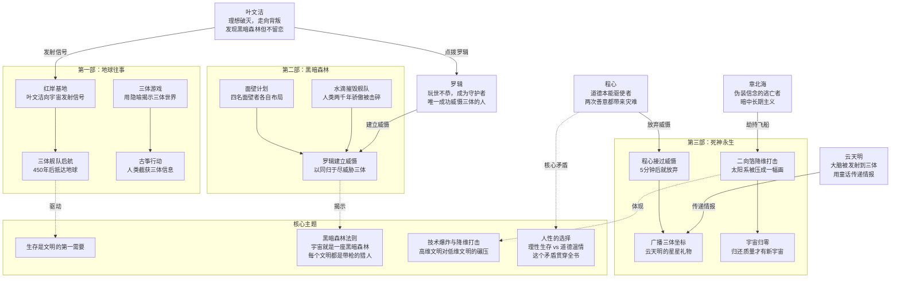
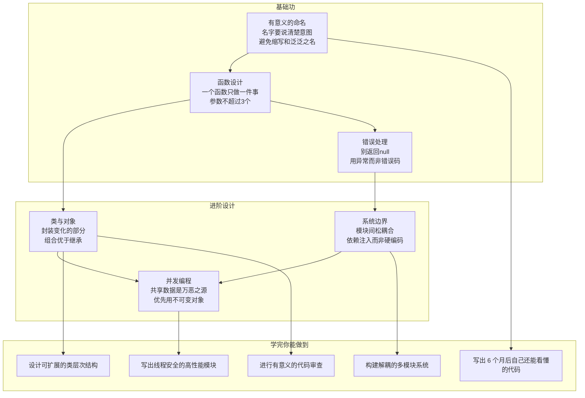
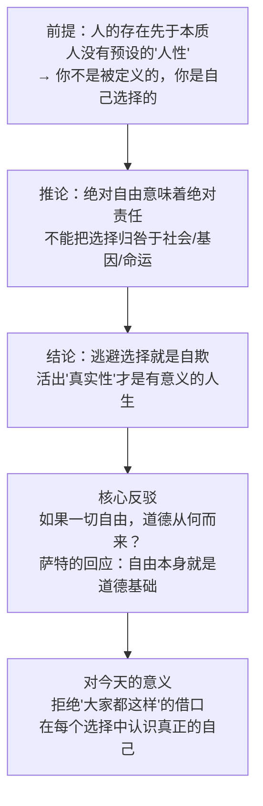
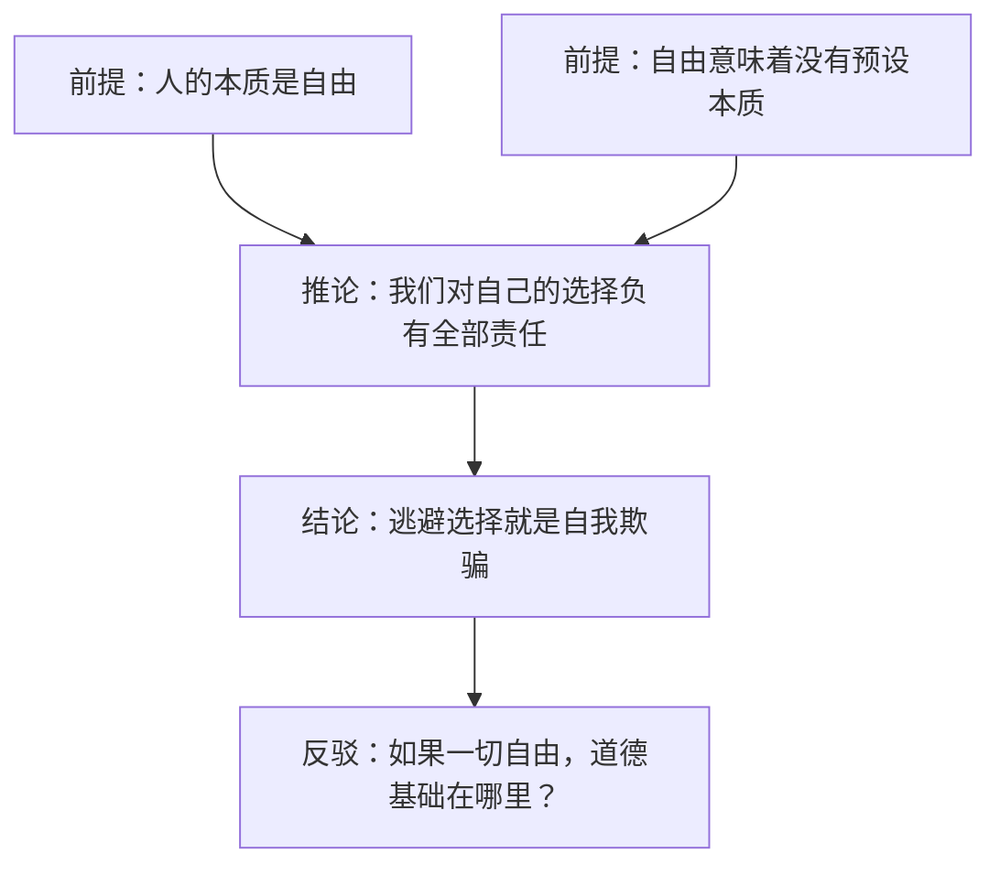
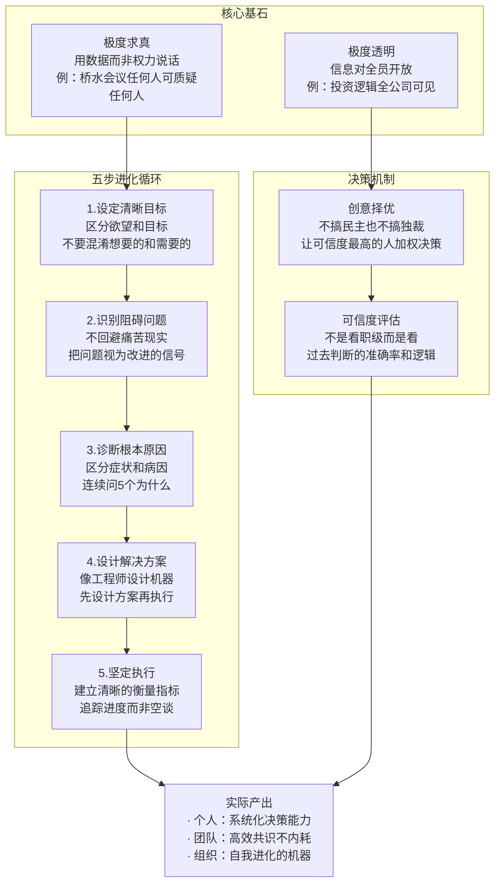
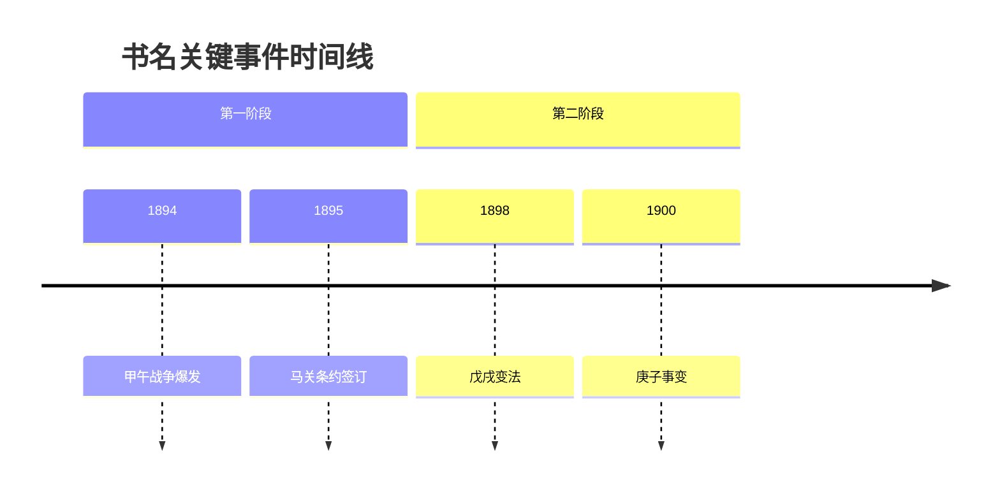
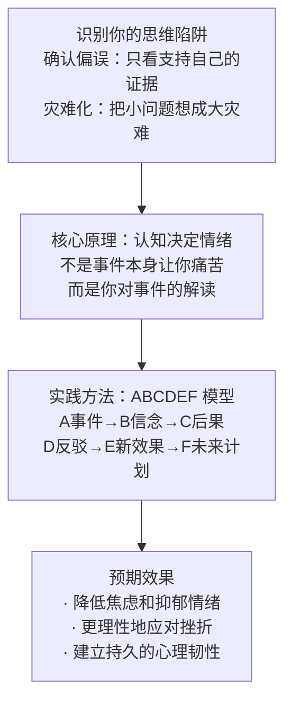

# 书籍类型模板

本文件为检视阅读 skill 的参考文件，包含各书籍类型的分类规则、文档侧重点、图表配置和内容分析模板。

当 SKILL.md 的 Step 2.1 判定出书籍类型后，参考本文件中对应类型的详细模板来规划文档内容和图表。

> **核心洞察图使用 SVG 渲染**：核心洞察图使用 SVG 格式，通过自由设计的图形元素、颜色分组和折线连线融合知识层、路径层、闭环层三层数据。本文件中的 Mermaid 代码示例仅供内容结构参考；实际渲染走 `beautiful-feishu-whiteboard` skill 的 SVG workflow（按书籍类型选风格、读 `RULES.md` 硬规则、生成 `diagram.svg`，见 SKILL.md Step 3.4 Subagent 2）。

## 类型判定规则

优先级从高到低：

1. `/book/info` 返回的 `category` 字段直接匹配
2. 书名和简介中的关键词匹配
3. 章节标题风格推断（"第 X 章"偏向叙事，"X.X X 概念"偏向技术/学术）

如果多个类型关键词同时出现，选择与书籍核心主题最匹配的那个。例如《人类简史》有"历史"也有"科普"，但其核心是历史叙事 → 归为"历史传记"。

---

## 各类型详细模板

### 1. 小说文学

**类型关键词**：文学、小说、名著、推理、科幻、武侠、言情、奇幻、短篇小说集

**文档侧重点**：
- 📖 书籍基本信息 → 正常展示，突出评分和在读人数
- 🗺️ 整体架构与关键概念 → 以叙事线索为骨架（非章节标题直译），按"起-承-转-合"或"引入-发展-高潮-结局"重构
- 核心洞察图 → 知识层：人物关系 + 路径层：情节推进 + 闭环层：命运循环
- 内容分析 → 侧重主题解读和人物分析

**图表配置**：

| 图表 | 渲染方式 | 内容 |
|------|---------|------|
| 书籍全景图 | Mermaid `mindmap` | 按叙事线索重构的信息密集思维导图，嵌入核心主题和关键场景 |
| 核心洞察图 | SVG | 知识层：人物关系（性格+命运转折）+ 核心主题；路径层：情节推进（起→承→转→合）；闭环层：人物命运循环 |
| 读者匹配图 | Mermaid `mindmap` | 四维度匹配：适合谁/将收获/不适合/投入 |

**核心洞察图要求**：

核心洞察图要**全面展示这本书的叙事世界**，融合三层数据，缺一不可：

1. **知识层**：主要人物之间的关系（边标注具体事件）+ 核心主题（独立色块分组）
2. **路径层**：关键情节点和转折，标注因果链（起→承→转→合）
3. **闭环层**：人物命运循环（性格缺陷→错误决定→后果→反思→重蹈覆辙或改变），用回路箭头标出核心飞轮

节点最低数量：**不少于 18 个**（人物 + 事件 + 主题 + 闭环合计）。人物关系图的通病是只画 5-6 个人物——远远不够，读者看完还是不知道这本书讲了什么。

好的示例（三体）——三个层次信息完整：

这张图让读者 1 分钟内就能理解：三体讲了什么故事、有哪些关键人物和转折、核心主题是什么。人物不只是名字——带着性格和命运转折；情节不只是事件——带着因果关系；主题不只是标签——标注了书中具体对应的情节。

**核心原则**：核心洞察图的信息量应该足够大，让读者**不需要再读其他文字，只看这张图就能判断这本书值不值得读**。同时要包含至少一个闭合回路，展示书中核心的命运循环或逻辑飞轮。

**内容分析模板**（按 5W1H 维度选择 5-8 个，How 必选）：

- 【Who】书中哪个人物最让你共鸣或反感？他/她的命运反映了什么样的人性特征？
- 【Who】如果你是 [某个角色]，在 [某个场景] 中你会做出不同的选择吗？
- 【What】主角在 [某个关键选择] 面前的动机是什么？这个选择如何推动了后续情节？
- 【What】书中反复出现的 [某个意象/主题] 代表了什么含义？作者通过它想探讨什么？
- 【When】这本书的时代背景如何影响了故事走向？如果把背景换成今天会怎样？
- 【Where】这个故事在你的文化背景中会发生什么变化？哪些冲突在不同文化中可能不成立？
- 【Why】[某个人物] 的行为在道德上站得住脚吗？作者到底是想让读者同情还是批判？
- 【Why】结局是否让你满意？作者为什么选择这样的收尾而不是另一种？
- 【How】读完这本书，你对 [某个主题/人际关系/自我认知] 有了什么新的理解？你会因此改变什么？

---

### 2. 技术实践

**类型关键词**：计算机、编程、技术、工程、软件、架构、算法、AI、数据、Web、开发

**文档侧重点**：
- 📖 书籍基本信息 → 突出技术栈、适用水平（入门/进阶/专家）
- 🗺️ 整体架构与关键概念 → 按知识模块组织，不按章节顺序
- 核心洞察图 → 知识层：知识体系 + 路径层：学习路径 + 闭环层：能力成长飞轮
- 内容分析 → 侧重实际应用和技术选型

**图表配置**：

| 图表 | 渲染方式 | 内容 |
|------|---------|------|
| 书籍全景图 | Mermaid `mindmap` | 按知识模块重构的信息密集思维导图 |
| 核心洞察图 | SVG | 知识层：知识依赖图 + 学完后能做什么；路径层：学习路径或实现流程；闭环层：能力成长飞轮 |
| 读者匹配图 | Mermaid `mindmap` | 四维度匹配 |

**核心洞察图要求**：

技术书的核心洞察图要融合三层数据：①知识体系结构 ②学习路径或实现流程 ③能力成长飞轮（学习→实践→反馈→改进）。节点不少于 18 个，用颜色分组区分三层，必须包含至少一个闭合回路展示能力成长的正反馈循环。

每个节点包含：概念名 + 一句话核心要点 + 具体原则。下方"学完你能做到"要对应到具体的、可衡量能力。

**内容分析模板**（按 5W1H 维度选择 5-8 个，How 必选）：

- 【Who】这本书最适合什么水平的开发者？如果你已经精通了，谁值得推荐给？
- 【What】书中 [概念A] 和 [概念B] 的本质区别是什么？容易混淆的点在哪里？
- 【What】作者推荐的最佳实践中，哪个最反直觉？为什么？
- 【When】书中的技术方案在什么条件下会过时或失效？哪些是经得起时间考验的原则？
- 【Where】这本书的技术栈在你当前项目中是否适用？哪些部分可以直接落地？
- 【Where】如果要在团队中推广，最大的阻力会来自哪里？如何解决？
- 【Why】作者选择 [某种技术方案] 而非主流方案的深层原因是什么？
- 【How】读完这本书，你会从哪个模块开始改变自己的代码/架构习惯？具体怎么做？

---

### 3. 哲学思想

**类型关键词**：哲学、思想、宗教、伦理、逻辑、美学、存在主义、儒家、道家、佛学

**文档侧重点**：
- 📖 书籍基本信息 → 突出思想流派和核心命题
- 🗺️ 整体架构与关键概念 → 按论题组织，非章节直译
- 核心洞察图 → 知识层：概念层级 + 路径层：思辨推演 + 闭环层：认知升级循环
- 内容分析 → 侧重批判性思考和个人反思

**图表配置**：

| 图表 | 渲染方式 | 内容 |
|------|---------|------|
| 书籍全景图 | Mermaid `mindmap` | 按论题重构的概念体系 |
| 核心洞察图 | SVG | 知识层：论证链路（前提→推理→结论→反驳）；路径层：思辨推演过程；闭环层：认知升级循环 |
| 读者匹配图 | Mermaid `mindmap` | 四维度匹配 |

**核心洞察图要求**：

哲学书的图表要融合三层数据：①论证的逻辑链路（前提→推理→结论→反驳）②思辨推演过程 ③认知升级循环（质疑→探索→重构→新问题）。每个节点要标注：这个前提为什么重要、推论是否成立、主要的反驳是什么。必须包含至少一个闭合回路展示认知升级的正反馈循环。

**论证逻辑图示例**：

**内容分析模板**（按 5W1H 维度选择 5-8 个，How 必选）：

- 【Who】作者属于哪个思想传统？他的观点与前辈有什么继承和突破？谁会反对他？
- 【What】[某个概念] 和日常理解有什么不同？这种重新定义有什么深意？
- 【What】你认同作者的核心论点吗？你能从自己的经验中找到支持或反对的例子吗？
- 【When】作者的论证在什么条件下会失效？最强的反驳是什么？
- 【Where】这本书的思想如何映射到你的日常生活？能举一个具体场景吗？
- 【Why】你认同作者的立场吗？如果不认同，分歧的根源是什么？
- 【How】这本书改变或强化了你的哪些既有观念？你会因此做出什么不同的决定？

---

### 4. 商业管理

**类型关键词**：商业、管理、经济、投资、营销、创业、领导力、战略、财务

**文档侧重点**：
- 📖 书籍基本信息 → 突出适用行业和目标读者
- 🗺️ 整体架构与关键概念 → 按框架/模型组织
- 核心洞察图 → 知识层：框架模型 + 路径层：方法论执行流程 + 闭环层：组织进化飞轮
- 内容分析 → 侧重实际应用和局限性分析

**图表配置**：

| 图表 | 渲染方式 | 内容 |
|------|---------|------|
| 书籍全景图 | Mermaid `mindmap` | 按业务模块重构的框架体系（信息密集） |
| 核心洞察图 | SVG | 知识层：框架拆解（要素+场景+案例）；路径层：方法论执行流程；闭环层：组织进化飞轮 |
| 读者匹配图 | Mermaid `mindmap` | 四维度匹配 |

**核心洞察图要求**：

商业书的图表要融合三层数据：①核心框架要素（每个要素的具体含义和案例）②方法论执行流程 ③组织进化飞轮。节点不少于 18 个，必须包含至少一个闭合回路展示组织进化的正反馈循环。

节点标注格式：`概念名 + 一句话解释 + 具体案例或实际产出`。

**内容分析模板**（按 5W1H 维度选择 5-8 个，How 必选）：

- 【Who】如果你的老板/下属读了这本书，谁会最不认同？分歧在哪里？
- 【What】书中的框架和同类书籍（如 [相关书名]）的观点有什么冲突？你更认同哪个？
- 【What】哪些案例最让你有启发？它揭示的核心规律是什么？
- 【When】作者的结论基于什么假设？在今天的商业环境中这些假设还成立吗？
- 【Where】书中的框架在你所在的组织中能落地吗？最大的障碍是什么？
- 【Why】书中提到的 [某个方法] 有什么局限性？作者为什么仍然推荐它？
- 【How】如果你是 CEO，读完这本书你会优先改变什么？第一步行动是什么？

---

### 5. 历史传记

**类型关键词**：历史、传记、回忆录、纪实、口述、年代、王朝、战争

**文档侧重点**：
- 📖 书籍基本信息 → 突出时间跨度和核心议题
- 🗺️ 整体架构与关键概念 → 按时间段或主题线索组织
- 核心洞察图 → 知识层：因果时间线 + 路径层：事件因果链 + 闭环层：历史因果螺旋
- 内容分析 → 侧重历史规律和现实启示

**图表配置**：

| 图表 | 渲染方式 | 内容 |
|------|---------|------|
| 书籍全景图 | Mermaid `mindmap` | 按时间段或主题线索重构 |
| 核心洞察图 | SVG | 知识层：因果时间线（事件+原因+后果）；路径层：事件因果链；闭环层：历史因果螺旋 |
| 读者匹配图 | Mermaid `mindmap` | 四维度匹配 |

**核心洞察图要求**：

历史书的图表要融合三层数据：①因果时间线（事件+原因+后果+对今天的影响）②事件因果链 ③历史因果螺旋（问题→应对→新问题→新应对）。必须标注因果关系和对今天的影响，让读者理解"为什么这件事改变了历史"。必须包含至少一个闭合回路展示历史因果螺旋。

**时间线图示例**：

**内容分析模板**（按 5W1H 维度选择 5-8 个，How 必选）：

- 【Who】作者的历史叙事有什么立场或倾向？谁的利益被代表了？谁被忽略了？
- 【Who】如果 [某个关键人物] 做出不同选择，历史走向会怎样？个人的力量到底有多大？
- 【What】[某个历史事件] 的根本原因是什么？有其他解释吗？
- 【When】这段历史和今天的 [某个现象] 有什么相似之处？本质相同还是表面相似？
- 【Where】书中揭示的 [某个历史规律] 在其他地区/文化中是否也成立？
- 【Why】作者为什么要选择这样的叙事角度？换一个角度会得出什么不同结论？
- 【How】这本书改变了你对 [某个历史事件/人物] 的看法吗？你会因此对什么持不同态度？

---

### 6. 科学科普

**类型关键词**：科学、科普、自然、数学、物理、化学、生物、天文、地理、医学

**文档侧重点**：
- 📖 书籍基本信息 → 突出科学领域和科普深度
- 🗺️ 整体架构与关键概念 → 按科学主题组织
- 核心洞察图 → 知识层：概念演进 + 路径层：发现过程 + 闭环层：认知演进循环
- 内容分析 → 侧重科学思维和日常应用

**图表配置**：

| 图表 | 渲染方式 | 内容 |
|------|---------|------|
| 书籍全景图 | Mermaid `mindmap` | 按科学主题重构 |
| 核心洞察图 | SVG | 知识层：概念演进（旧认知→新发现→意义）；路径层：发现或实验过程；闭环层：认知演进循环 |
| 读者匹配图 | Mermaid `mindmap` | 四维度匹配 |

**核心洞察图要求**：

科普书的图表要融合三层数据：①概念演进（旧认知→新发现→这改变了什么）②发现或实验过程 ③认知演进循环（旧理论→反常→新假说→验证→新理论）。每个概念都要有"所以呢"的解释。必须包含至少一个闭合回路展示认知演进的螺旋。

**内容分析模板**（按 5W1H 维度选择 5-8 个，How 必选）：

- 【Who】作者对 [某个争议话题] 的态度是否客观？有没有忽略重要证据或对立观点？
- 【What】书中 [某个科学概念] 如何改变了你对世界的理解？最令你惊讶的是什么？
- 【What】作者用了哪些类比来解释复杂原理？这些类比的局限在哪里？
- 【When】[某个发现] 在科学史上为什么发生在那个时间点？如果早50年发现会怎样？
- 【Where】书中的知识在你所处的行业或生活场景中有什么实际意义？
- 【Why】[某个发现] 的过程对你理解"科学方法"有什么启发？为什么这个实验设计如此关键？
- 【How】这本书让你对什么产生了新的好奇心？你会从哪个话题开始深入了解？

---

### 7. 心理自助

**类型关键词**：心理、自助、成长、健康、冥想、情绪、习惯、认知、沟通

**文档侧重点**：
- 📖 书籍基本信息 → 突出核心方法论和适用人群
- 🗺️ 整体架构与关键概念 → 按主题/方法组织
- 核心洞察图 → 知识层：理论框架 + 路径层：改变路径 + 闭环层：改变循环
- 内容分析 → 侧重个人反思和行为改变

**图表配置**：

| 图表 | 渲染方式 | 内容 |
|------|---------|------|
| 书籍全景图 | Mermaid `mindmap` | 按主题重构的体系 |
| 核心洞察图 | SVG | 知识层：方法论地图（问题→原理→方法→效果）；路径层：改变路径；闭环层：改变循环 |
| 读者匹配图 | Mermaid `mindmap` | 四维度匹配 |

**核心洞察图要求**：

心理自助书的图表要融合三层数据：①方法论地图（问题识别→原理→方法→预期效果）②改变路径（识别问题→理解原理→实践方法→巩固习惯）③改变循环（觉察→行动→正反馈→强化→更深觉察）。每个步骤都要包含具体方法和预期效果，而非只是抽象的阶段名。必须包含至少一个闭合回路展示改变的正反馈循环。

**内容分析模板**（按 5W1H 维度选择 5-8 个，How 必选）：

- 【Who】你在过去是否遇到过书中描述的 [某种心理模式]？你周围谁最可能有同样的模式？
- 【What】作者的建议中，哪个最让你有"被点醒"的感觉？它改变了你什么认知？
- 【What】书中的方法和你之前了解的其他方法有什么异同？本质区别在哪里？
- 【When】[某个理论] 是否有科学依据？在什么人群中验证过、什么人群中可能不适用？
- 【Where】书中 [某个方法] 在你的生活场景中适用吗？在什么场景下可能适得其反？
- 【Why】为什么你会反复陷入 [某种模式]？书中的原理解释是否符合你的体验？
- 【How】读完这本书，你打算做哪一件具体的事来改变？明天就开始的第一步是什么？

---

### 8. 社会科学

**类型关键词**：社科、政治、教育、法律、社会、人类学、社会学、传播

**文档侧重点**：
- 📖 书籍基本信息 → 突出研究领域和核心论题
- 🗺️ 整体架构与关键概念 → 按论题组织
- 核心洞察图 → 知识层：理论结构 + 路径层：论证流程 + 闭环层：社会演变循环
- 内容分析 → 侧重批判性思考和社会观察

**图表配置**：

| 图表 | 渲染方式 | 内容 |
|------|---------|------|
| 书籍全景图 | Mermaid `mindmap` | 按论题重构 |
| 核心洞察图 | SVG | 知识层：论点结构（命题→证据→反驳→综合）；路径层：研究或论证流程；闭环层：社会演变循环 |
| 读者匹配图 | Mermaid `mindmap` | 四维度匹配 |

**核心洞察图要求**：

社科书的图表要融合三层数据：①论点结构（核心命题+证据+反驳+综合）②研究或论证流程 ③社会演变循环（制度→行为→结果→制度调整）。必须展示论证的完整逻辑链，包括对立观点和作者的回应，帮助读者形成自己的判断。必须包含至少一个闭合回路展示社会演变的循环。

**内容分析模板**（按 5W1H 维度选择 5-8 个，How 必选）：

- 【Who】作者的观点和主流媒体/公共讨论有什么不同？谁的声音被代表了，谁被忽略了？
- 【Who】如果向朋友推荐这本书的一个核心观点，你会说什么？谁最需要听到这个观点？
- 【What】作者的核心论点是否说服了你？最强和最弱的论据分别是什么？
- 【When】作者的分析基于什么时期的数据/案例？今天的社会条件是否已发生变化？
- 【Where】书中的分析框架适用于你所在的社会环境吗？有什么局限？
- 【Why】[某个现象] 在你的日常观察中是否存在？你有没有不同的解读？为什么会有这种分歧？
- 【How】这本书如何改变了你对 [某个社会议题] 的看法？你会因此采取什么行动？

---

### 9. 通用（默认）

当书籍分类无法匹配以上任何类型时使用。

**文档侧重点**：
- 🗺️ 整体架构与关键概念 → 直接基于章节目录生成
- 核心洞察图 → 基于章节目录的知识结构 + 逻辑推进路径 + 核心观点闭环
- 内容分析 → 使用通用模板

**内容分析模板**（按 5W1H 维度选择 5-8 个，How 必选）：

- 【Who】你会把这本书推荐给谁？谁最需要读它？
- 【What】这本书的核心论点/主题是什么？书中最让你有收获的观点是什么？
- 【When】作者的结论在什么条件下成立？在今天仍然适用吗？
- 【Where】书中的观点在你所处的领域/环境中成立吗？有什么需要调整的？
- 【Why】作者写作这本书的主要目的是什么？这个目的达成了吗？
- 【Why】书中有什么让你困惑或不同意的观点？分歧的根源是什么？
- 【How】读完这份检视阅读报告，你是否想精读这本书？下一步你会做什么？
